# 📱 Advanced Calculator – Flutter Project

Một ứng dụng máy tính nâng cao được xây dựng bằng **Flutter**, hỗ trợ **3 chế độ tính toán**: Basic, Scientific và Programmer. Ứng dụng có giao diện hiện đại, hỗ trợ **Light/Dark theme**, lưu trữ **history**, và nhiều tính năng mở rộng.

---

## ✨ Tính năng chính

### 🔢 **1. Basic Mode (Chế độ Cơ bản)**

* Các phép tính cơ bản: `+  -  ×  ÷`
* Phần trăm `%`
* Đổi dấu `±`
* Xóa `C, CE`

---

### 🧪 **2. Scientific Mode (Chế độ Khoa học)**

* Hàm lượng giác: `sin, cos, tan`
* Logarithm: `ln`, `log`
* Lũy thừa & căn: `x²`, `√`, `x^y`
* Ngoặc đơn `( )`
* Hằng số: `π`
* Memory functions: `M+`, `M-`, `MR`, `MC`
* Chế độ góc: **DEG / RAD**

---

### 💻 **3. Programmer Mode (Chế độ Lập trình viên)**

* Hệ số: **BIN · OCT · DEC · HEX**
* Bitwise operations:

  * `AND`, `OR`, `XOR`, `NOT`
* Bit shifting:

  * `<<`, `>>`
* Hỗ trợ nhập số Hexadecimal: `A–F`

---

## 🎨 Giao diện & Theme

### Light Theme

* Accent: `#FF6B6B` (đỏ cam)
* Giao diện sáng, dễ nhìn

### Dark Theme

* Accent: `#4ECDC4` (xanh ngọc)
* Tối ưu dùng ban đêm

### Hiệu ứng

* Animation mượt cho:

  * Button press
  * Mode switching
  * Error display

---

## 💾 Lưu trữ & Lịch sử Tính toán

* Lưu tối đa **25 / 50 / 100** phép tính
* Lưu qua **SharedPreferences**
* Xem chi tiết: expression + result
* Xóa từng mục hoặc toàn bộ

---

## ⚙️ Cài đặt (Settings)

* Chọn theme: **Light / Dark / System**
* Decimal precision: **2–10 digits**
* Angle mode: Degree / Radian
* Haptic feedback
* Sound effects
* History size: 25/50/100

---
Dưới đây là phiên bản README có thêm mục **📸 Screenshots** với layout đẹp, sẵn chỗ để bạn dán hình vào.
Bạn chỉ cần thay thế các đường dẫn ảnh bằng ảnh của dự án bạn.

---

## 📸 Screenshots

Bạn có thể dán ảnh dự án vào khung dưới đây.
Khuyến nghị: dùng ảnh kích thước **390×844** (tỷ lệ điện thoại).

### **📱 Basic Mode**

|                                                 |                                                 |
| ----------------------------------------------- | ----------------------------------------------- |
| 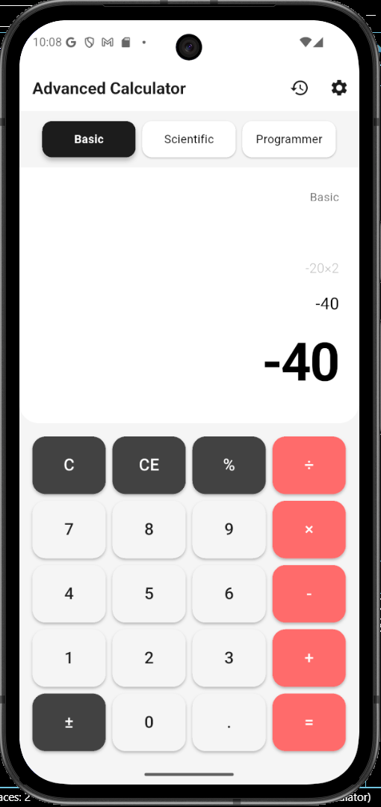 | 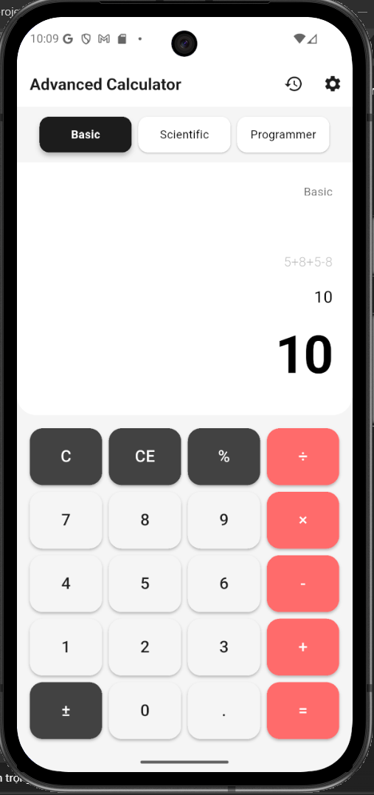 |

---

### **🧪 Scientific Mode**

|                                                           |                                                           |
| --------------------------------------------------------- | --------------------------------------------------------- |
| 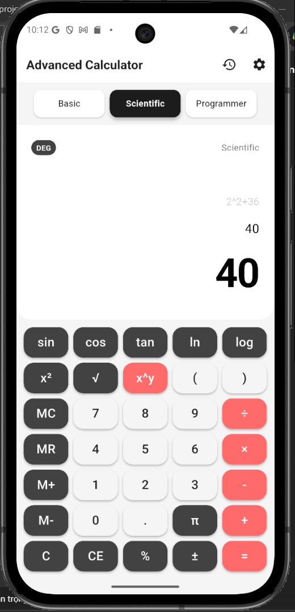 | 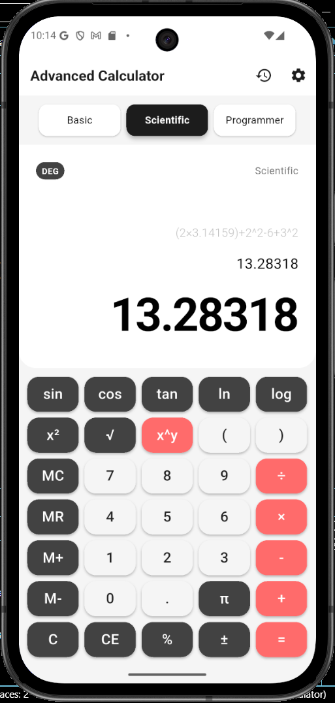 |

---

### **💻 Programmer Mode**

|                                                           |                                                           |
| --------------------------------------------------------- | --------------------------------------------------------- |
| 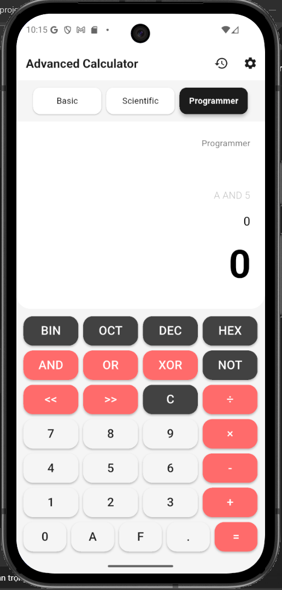 | 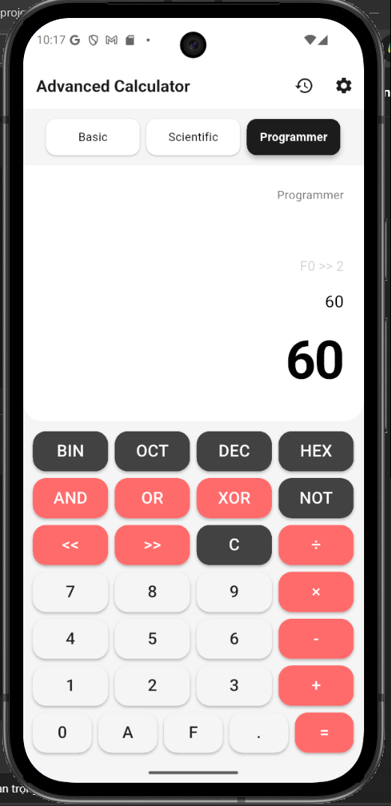 |

|                                                           |                                                           |
| --------------------------------------------------------- | --------------------------------------------------------- |
| 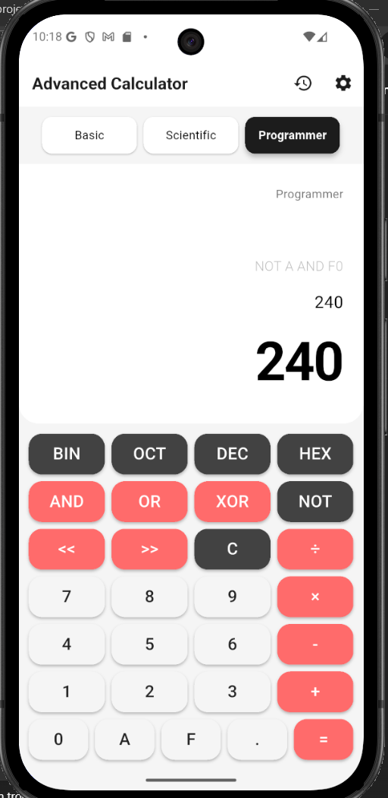 | 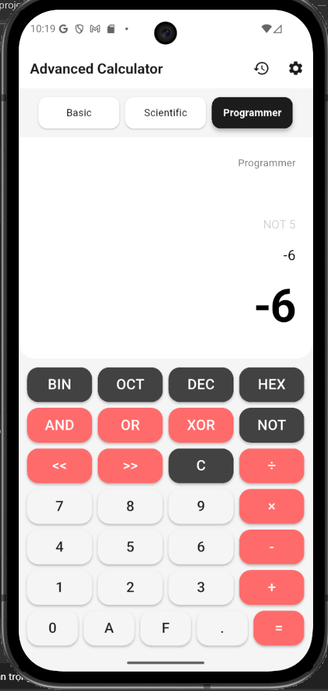 |
---

### **🎨 Theme Showcase**

| Light Theme                            | Dark Theme                           |
| -------------------------------------- | ------------------------------------ |
| 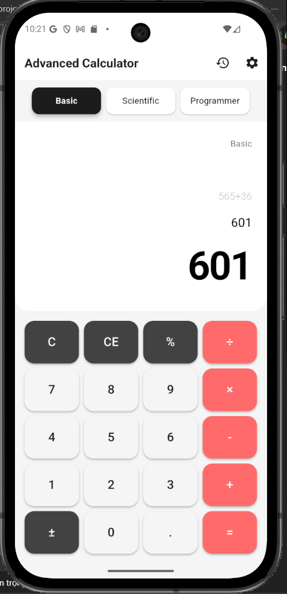 | 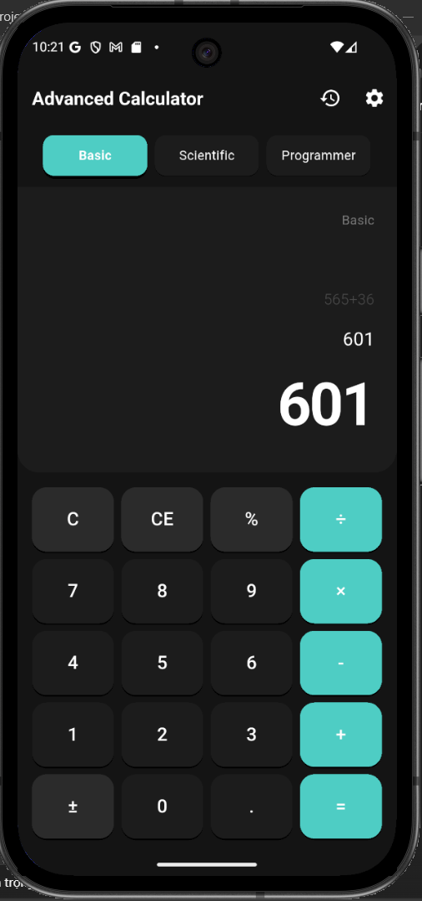 |

---

### **📜 History & Settings**


| ------------------------------------------ | -------------------------------------------- |
| 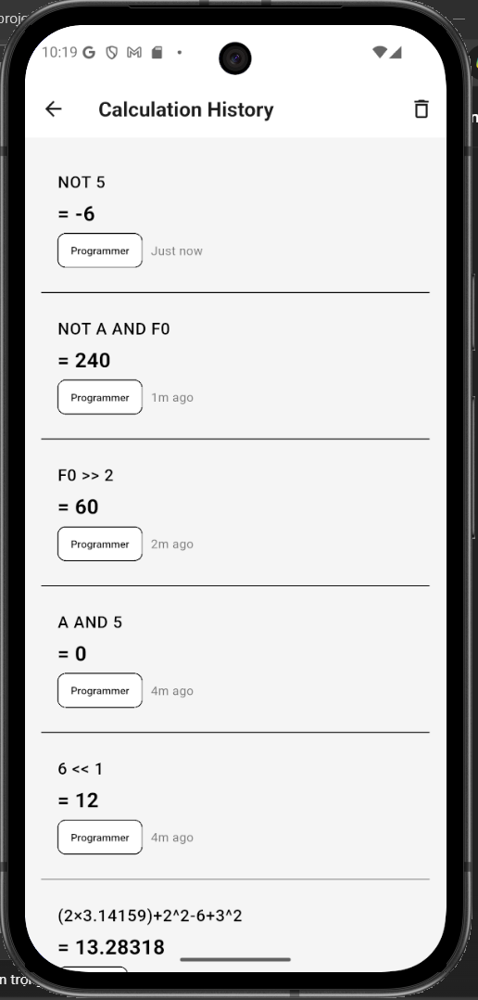 | 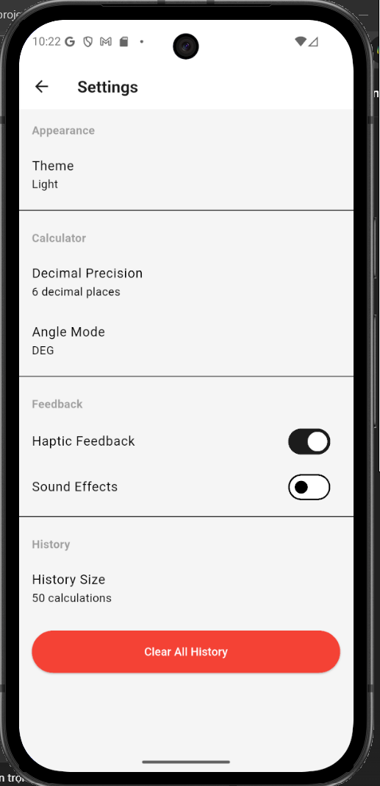 |

| ------------------------------------------------------- | -------------------------------------------------------------- |
| 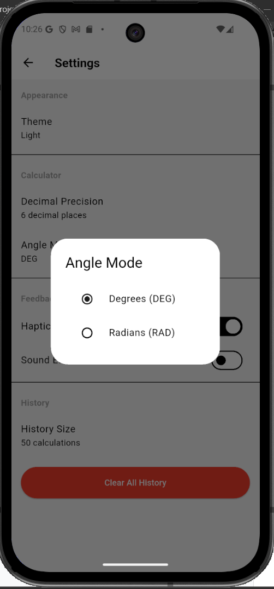 | 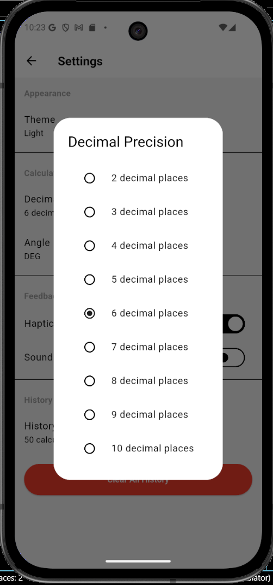 |

| ---------------------------------------------------- | -------------------------------------------------- |
| 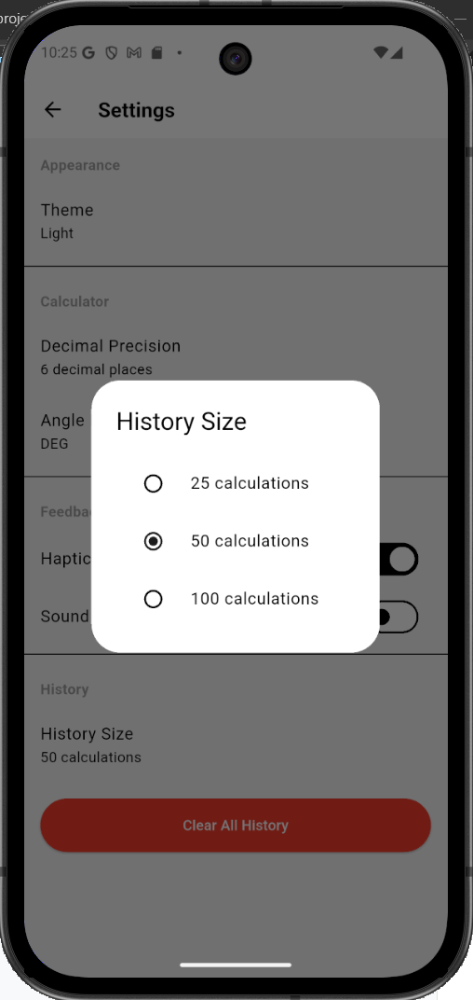 | 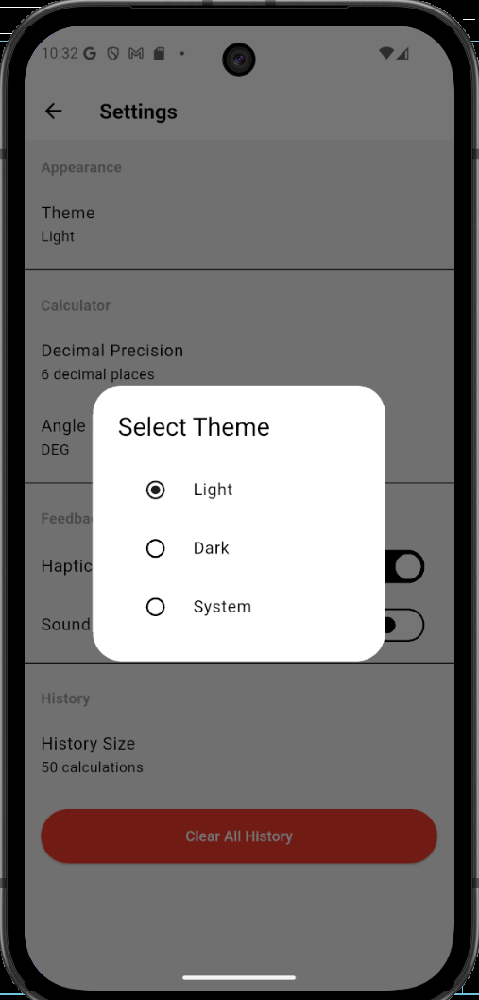 |

---

## 🏗️ Kiến trúc Project

```
lib/
├── main.dart                          # Entry point
├── models/                            # Data models
│   ├── calculation_history.dart       # Model lịch sử tính toán
│   ├── calculator_mode.dart           # Enum các mode & angle mode
│   └── calculator_settings.dart       # Model cài đặt
├── providers/                         # State management (Provider)
│   ├── calculator_provider.dart       # Logic tính toán chính
│   ├── theme_provider.dart            # Quản lý theme
│   └── history_provider.dart          # Quản lý lịch sử
├── screens/                           # Các màn hình
│   ├── calculator_screen.dart         # Màn hình calculator chính
│   ├── history_screen.dart            # Màn hình lịch sử
│   └── settings_screen.dart           # Màn hình cài đặt
├── widgets/                           # Các widget tùy chỉnh
│   ├── display_area.dart              # Vùng hiển thị kết quả
│   ├── button_grid.dart               # Lưới nút bấm
│   ├── calculator_button.dart         # Nút calculator với animation
│   └── mode_selector.dart             # Bộ chọn mode
├── utils/                             # Utilities
│   ├── calculator_logic.dart          # Logic hàm khoa học
│   ├── expression_parser.dart         # Parser biểu thức toán học
│   ├── programmer_calculator.dart     # Logic programmer mode
│   └── constants.dart                 # Theme & constants
└── services/                          # Services
    └── storage_service.dart           # Local storage với SharedPreferences
```

---

## 🔧 Công nghệ Sử dụng

### Dependencies

```yaml
dependencies:
  flutter:
    sdk: flutter
  provider: ^6.0.5
  shared_preferences: ^2.2.2
```

### Design Patterns

* **Provider Pattern**
* **Repository Pattern**
* **Separation of Concerns**
* **Recursive Descent Parser** (tuân thủ PEMDAS)

---

# 🚀 Cài đặt & Chạy

### Yêu cầu

* Flutter SDK ≥ 3.0.0
* Dart ≥ 3.0.0

### Cài đặt

```bash
git clone <repository-url>
cd advanced-calculator
flutter pub get
flutter run
```

### Build APK

```bash
flutter build apk --release
```

### Build iOS

```bash
flutter build ios --release
```

---

# 📐 Thuật toán Expression Parser

### Quy tắc **PEMDAS**

1. **P** – Parentheses `()`
2. **E** – Exponents `^`
3. **M/D** – Multiply / Divide
4. **A/S** – Add / Subtract

### Ví dụ

```
5 + 3 × 2 = 11
(5 + 3) × 2 = 16
2^3^2 = 512          // Right-associative
10 - 5 - 2 = 3       // Left-associative
```

---

# 🔣 Programmer Mode

### Thứ tự ưu tiên (cao → thấp)

1. `NOT`
2. Shift: `<<`, `>>`
3. `AND`
4. `XOR`
5. `OR`

### Ví dụ

```
A AND 5 = 0
A OR 5 = 15
A XOR 5 = 15
F0 >> 2 = 60
8 << 2 = 32
NOT 5 = -6
FF AND F0 = 240
```

---

# 🧪 Test Cases

### Basic

```
✓ 5 + 3 = 8
✓ 5 + 3 × 2 = 11
✓ (5 + 3) × 2 = 16
✓ 10 - 5 - 2 = 3
✓ 10 ÷ 2 = 5
✓ -5 + 3 = -2
```

### Scientific

```
✓ sin(45°) ≈ 0.707107
✓ cos(45°) ≈ 0.707107
✓ ln(e) = 1
✓ log(100) = 2
✓ √9 = 3
✓ 2^3 = 8
✓ 2^3^2 = 512
```

### Programmer

```
✓ A AND 5 = 0
✓ A OR 5 = 15
✓ A XOR 5 = 15
✓ F0 >> 2 = 60
✓ 8 << 2 = 32
✓ NOT 5 = -6
✓ FF AND F0 = 240
```

---

# 🎨 Theme Colors

| Theme     | Primary | Secondary | Accent      |
| --------- | ------- | --------- | ----------- |
| **Light** | #1E1E1E | #424242   | **#FF6B6B** |
| **Dark**  | #121212 | #2C2C2C   | **#4ECDC4** |

---

# 🐛 Known Issues

* Programmer mode mới hỗ trợ decimal & hex input
* Binary / Octal chưa implement
* Chưa bật các nút chuyển hệ số (BIN/OCT/DEC/HEX)

---

# 🔮 Future Enhancements

* Binary / Octal input
* Number system conversion
* Graph plotting
* Scientific notation
* Equation solver
* Unit converter
* Export/Import history
* Custom themes

---

# 📄 License

**MIT License** – Free to use and modify.

---

# 👨‍💻 Developer

**Nguyen Chung Hieu**
GitHub: `https://github.com/henryauthentic/flutter_advanced_calculator_NguyenChungHieu`
Email: `Hieu77095@gmail.com`

---

# 🙏 Acknowledgments

* GDHD: Tran Thi Quynh Nga

---
